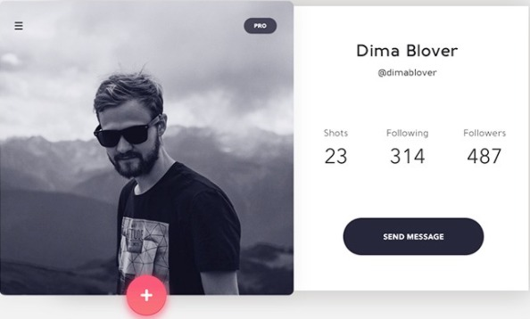

# DOM

- Create a folder with their name.
- Inside the previously created folder create an `index.html`, `scripts.js` and `style.css` file.
- Inside of `scripts.js` create an object with the follow personal information.

```
const myUser = {
  displayName: "Maria Camila Gomez",
  userName: "",
  image: "",
  role: "developer",
  socialMedia: [
    {
      name: "Github",
      icon: "",
      link: ""
    },
    {
      name: "Twitter",
      icon: "",
      link: ""
    },
    {
      name: "Instagram",
      icon: "",
      link: ""
    },
  ],
}
```

- Create a function to add your information to the DOM.
- Add styles.

> Note: Feel free to add the personal information that you want to.

### Guide line

- Component must be centered in the page.
- Max width 800px.
- Max height 400px.
- Main tiple has a 40px font size.
- Use icons to link your social media profiles over the `send message` button.


